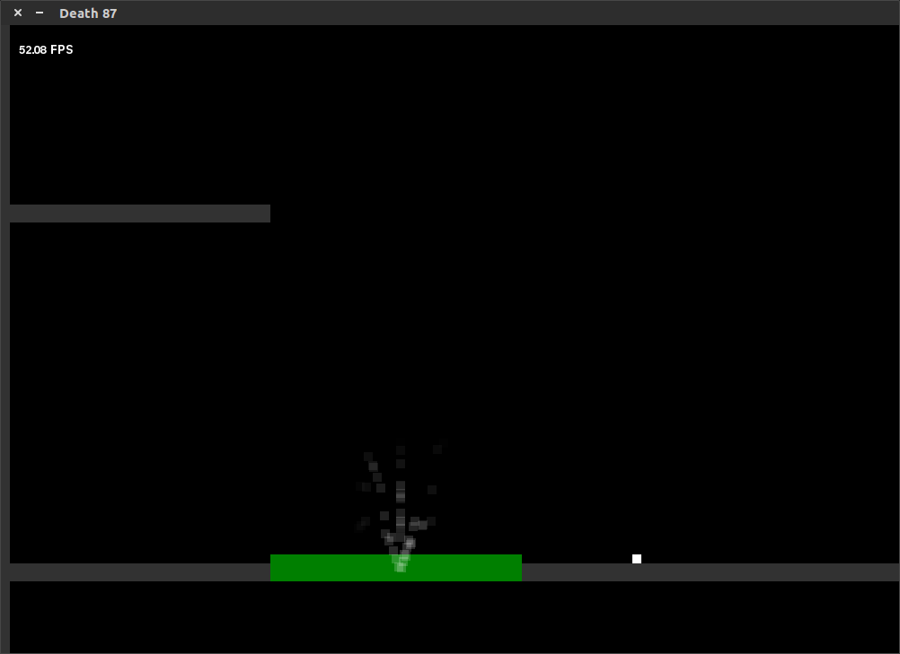

```
 ______   _______  _______ _________             _____   ______  
(  __  \ (  ____ \(  ___  )\__   __/|\     /|   / ___ \ / ___  \  
| (  \  )| (    \/| (   ) |   ) (   | )   ( |  ( (___) )\/   )  )  
| |   ) || (__    | (___) |   | |   | (___) |   \     /     /  /  
| |   | ||  __)   |  ___  |   | |   |  ___  |   / ___ \    /  /  
| |   ) || (      | (   ) |   | |   | (   ) |  ( (   ) )  /  /   
| (__/  )| (____/\| )   ( |   | |   | )   ( |  ( (___) ) /  /    
(______/ (_______/|/     \|   )_(   |/     \|   \_____/  \_/     
No reason for the name, just roll with it.
```



## Directory Structure
### / (root)
This is where you find the main files for the game, including Main.py (suprise, suprise),
Scene.py (The thing that allows you to load scenes in .json format), and Group.py.

### /assets
This is where all the sounds and images for the game are. I made the music with [Soundation](https://soundation.com/)

### /objects
Where all the in-game objects are. This includes Walls, players and text.
